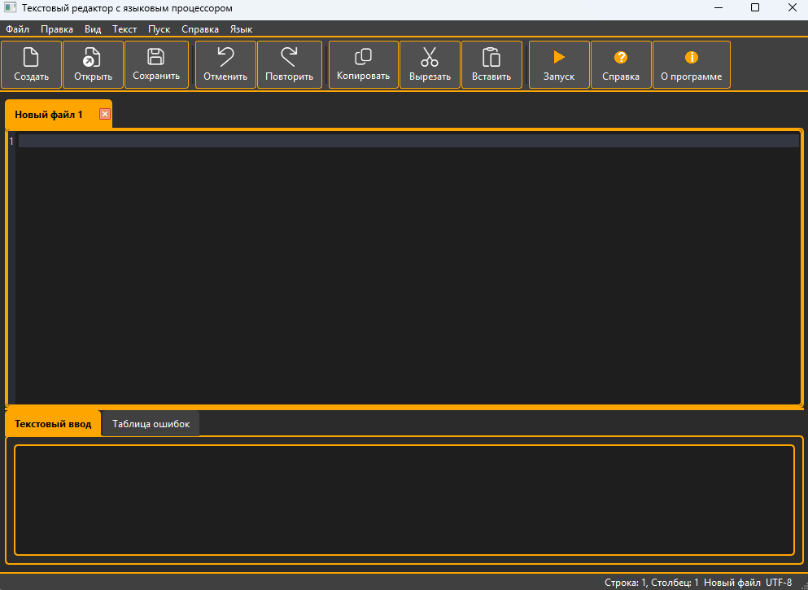
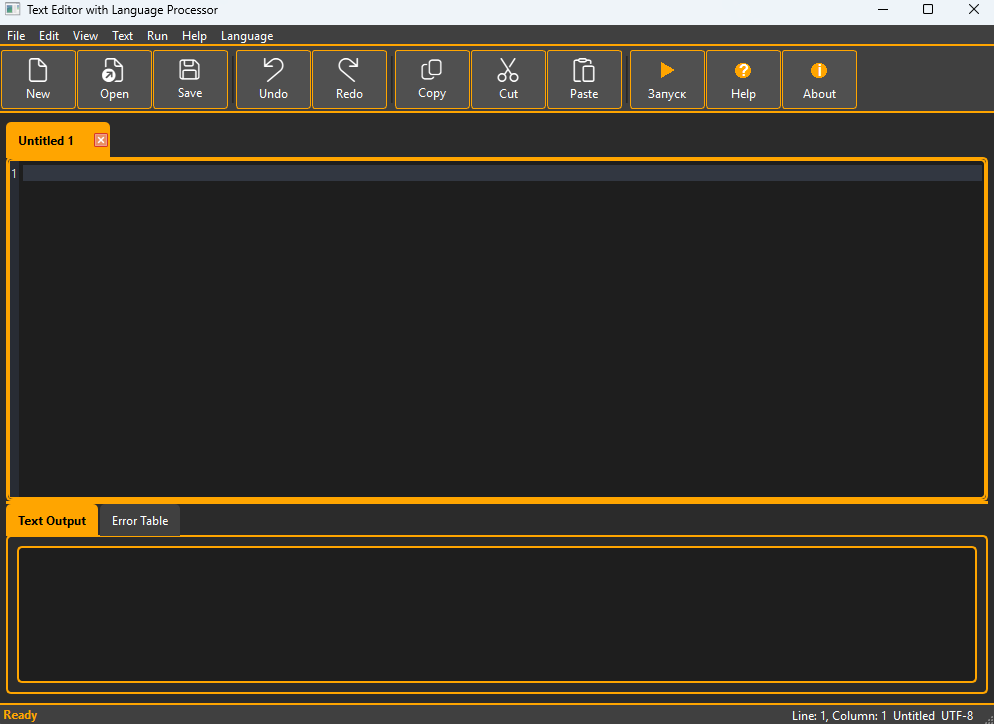
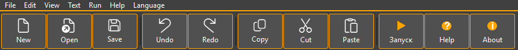
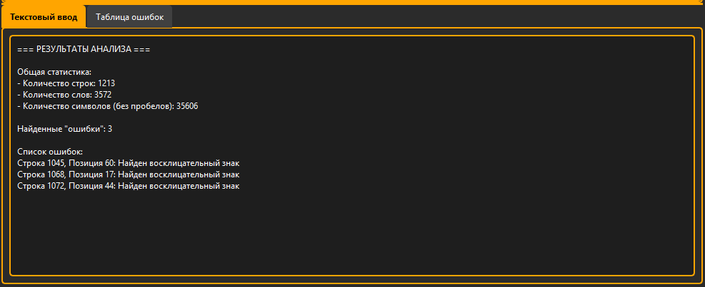
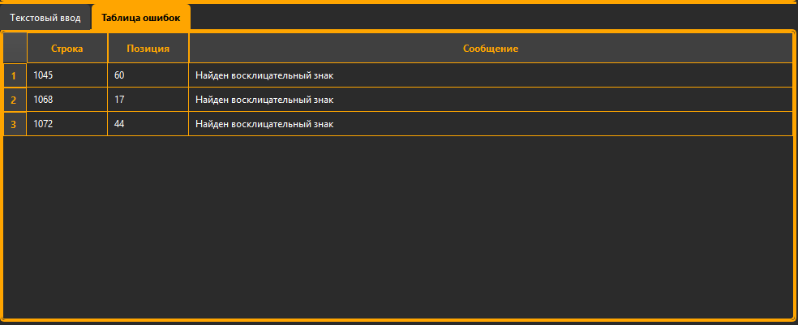
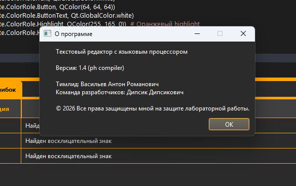
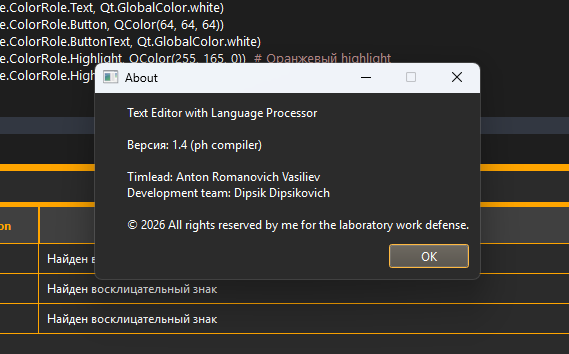
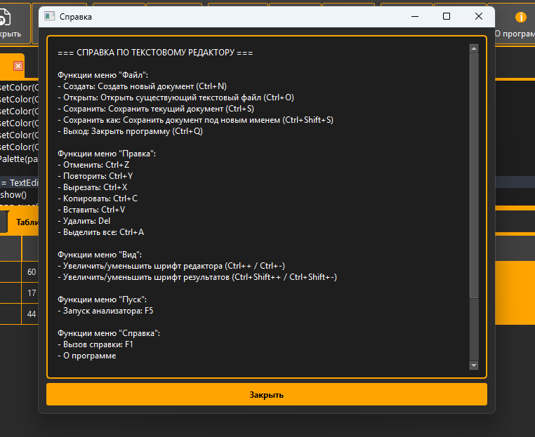
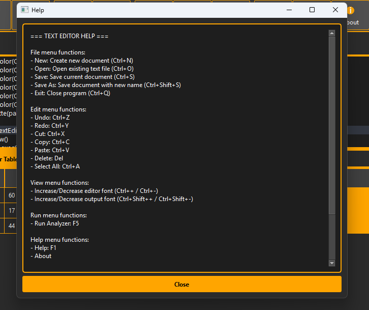

# Разработка пользовательского интерфейса (GUI) для языкового процессора

**Учебная работа**  
**Тема:** Разработка приложения – текстовый редактор с графическим интерфейсом пользователя (GUI)  
**Язык реализации:** Python + PyQt6  
**Дата:** Февраль 2026


## Цель работы

Разработать приложение — текстовый редактор с графическим интерфейсом, соответствующий заданным требованиям и примеру интерфейса.


## Соответствие заданию

Интерфейс полностью соответствует приведённому в задании примеру:

****

**На рисунке обозначены:**
- 1) — основное меню программы
- 2) — панель инструментов
- 3) — область ввода/редактирования текста
- 4) — область отображения результатов (ввод запрещён)

# Текстовый редактор с языковым процессором

## Реализованные функции

### Основное меню

| Меню | Пункты |
|------|--------|
| **Файл** | Создать, Открыть, Сохранить, Сохранить как, Выход |
| **Правка** | Отменить, Повторить, Вырезать, Копировать, Вставить, Удалить, Выделить все |
| **Вид** | Увеличить шрифт редактора, Уменьшить шрифт редактора, Увеличить шрифт результатов, Уменьшить шрифт результатов |
| **Текст** | Постановка задачи, Грамматика, Классификация грамматики, Метод анализа, Тестовый пример, Список литературы, Исходный код программы |
| **Пуск** | Запуск анализатора |
| **Справка** | Вызов справки, О программе |
| **Язык** | Русский / English |

### Панель инструментов

Панель содержит кнопки для вызова часто используемых функций с иконками и текстом:

| № | Действие |
|---|----------|
| 1 | Создать |
| 2 | Открыть |
| 3 | Сохранить |
| 4 | Отменить |
| 5 | Повторить |
| 6 | Копировать |
| 7 | Вырезать |
| 8 | Вставить |
| 9 | Запуск анализатора |
| 10 | Справка |
| 11 | О программе |

### Область редактирования текста

- **Многовкладочный редактор** с возможностью закрытия вкладок
- **Нумерация строк** с серой областью слева
- **Подсветка синтаксиса:**
  - Ключевые слова — оранжевым (if, else, while, def и др.)
  - Строки — светло-зеленым
  - Комментарии — коричневатым
- **Подсветка текущей строки** темно-серым фоном
- **Масштабирование шрифта** редактора (Ctrl++ / Ctrl+-)
- **Масштабирование шрифта** области результатов (Ctrl+Shift++ / Ctrl+Shift+-)
- **Поддержка Drag & Drop** текстовых файлов (.txt)
- **Undo/Redo/Cut/Copy/Paste** с поддержкой горячих клавиш
- **Индикация изменений** — звездочка (*) на вкладке при несохраненных изменениях

### Область результатов

**Две вкладки:**
- **Текстовый ввод** — подробный текстовый отчет с результатами анализа
- **Таблица ошибок** — структурированное отображение (Строка | Позиция | Сообщение)

### Реализованные дополнительные возможности

- **Полная локализация интерфейса** (русский / английский) с переключением "на лету"
- **Статусная строка:**
  - Позиция курсора (строка, столбец)
  - Имя текущего файла
  - Индикатор кодировки (UTF-8)
- **Подтверждение сохранения** при закрытии изменённых вкладок и программы
- **Сплиттер** для изменения размеров областей
- **Кастомная цветовая схема** с оранжевым акцентом
- **Стилизованные компоненты:** меню, тулбар, таблица, статус-бар, диалоги
- **Встроенный пример анализатора** с поиском восклицательных знаков
- **Поддержка горячих клавиш** для всех основных операций

## Скриншоты реализованного приложения

### Главное окно (русский язык)


### Главное окно (английский язык)


### Панель инструментов


### Область результатов и ошибок



### Статусная строка


### Диалог «О программе»



### Диалог справки



## Установка и запуск

### Требования

- Python 3.8+
- PyQt6

### Установка зависимостей

```bash
pip install PyQt6